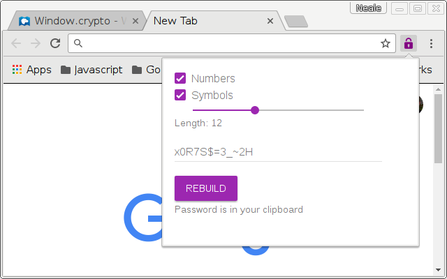

This is a very simple, but cryptographically decent, password generator.

Click on the extension icon, and it makes a password of length 12
You can dial the length up or down and tell it not to include certain character classes,
and the password is updated automatically.

The extension makes sure any generated password is in your clipboard.
So when you need a password,
typically you can click the extension,
then go back to the form and paste in your new password.

Hooray!