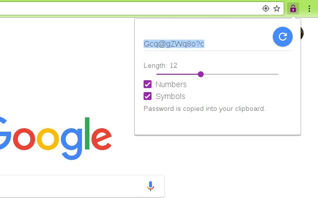

This is a very simple,
but cryptographically not awful,
password generator.

Click on the extension icon, and it makes a password of length 12.
You can dial the length up or down and tell it not to include certain character classes,
and the password is updated automatically.

The extension makes sure any generated password is in your clipboard.
So when you need a password,
typically you can click the extension,
then go back to the form and paste in your new password.

Hooray!

Cryptographically Not Awful
---------------------------

There are password generators that go to great lengths to use
high-entropy seeds for their random number generators.
This one uses `window.crypto.getRandomValues`,
which is good enough for my purposes.
You'll have to decide if it's good enough for yours.
Feel free to
[read the code](js/popup.js)
and decide for yourself.
